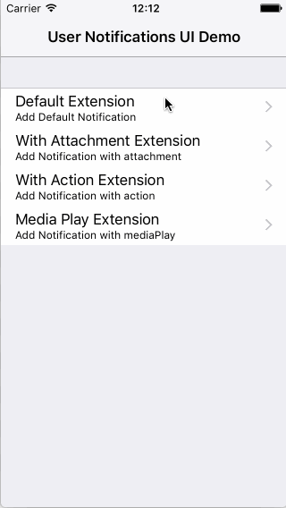
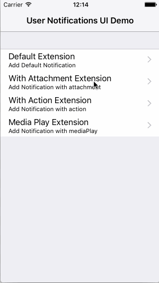
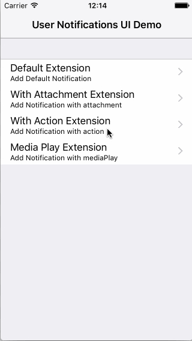
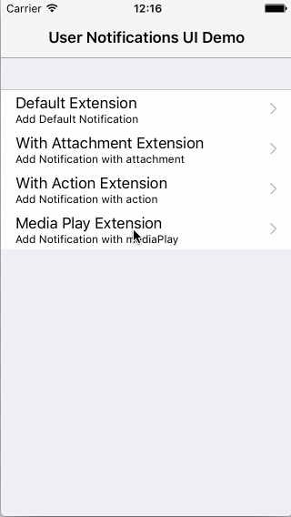

# UserNotificationsUIDemoApp
Demo app for User Notifications UI framework.

The User Notifications UI framework was introduced in iOS 10. API Reference of this framework is [here](https://developer.apple.com/reference/usernotificationsui).

## Requirements
- Xcode 8+
- iOS 10+

# Extensions
This demo app contains the following extensions.

## Default Extension
- Default app extension

## With Attachment Extension
- App extension for displaying attachment file.

## With Action Extension
- App extension for notification action.

## Media Play Extension
- App extension for playing audio.

